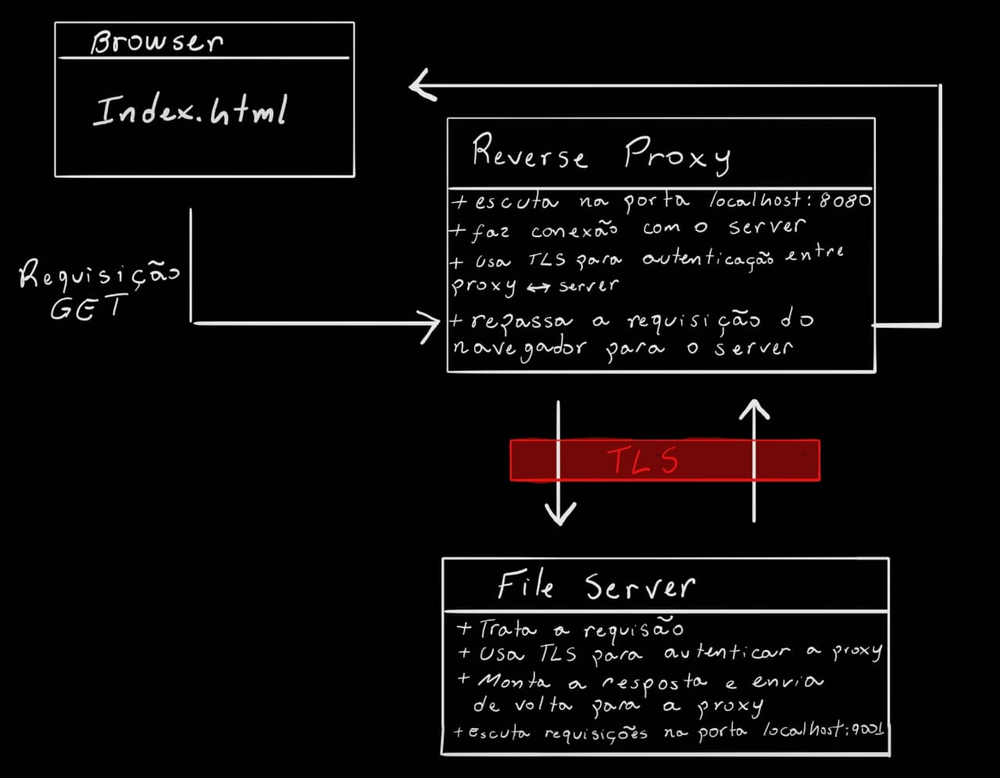

# PATOS PSEL

Bom dia, me chamo Eduardo, estou no segundo semestre de BCC, e esse é o meu psel.

## Sobre mim

Meu interesse pelo Patos, surgiu por conta de ser um grupo com foco em código livre e abordarem bastante os fundamentos da computação. Isto acabou me chamando atenção, pois, já tinha a vontade de me aprofundar na área de redes, cloud computing, e afins, e tambem quem sabe um dia, trabalhar com open-source.

## Sobre o psel

### Por que GO?

Devido o meu interesse em engenharia de nuvem, após algumas pesquisas, vi que o GO era muito ulitilizado na área. Isso foi ótimo, já que surgiu uma oportunidade de aprender na prática algo que seria muito útil. A indicação dessa linguagem para fazer o processo, também influenciou na escolha.

### Estrutura do projeto

O desafio é construir um reverse proxy para um file server. Dessa forma, a estrutura do fluxo para o projeto ficou mais ou menos assim:




### Sobre GO TLS (Transport layer security)

Essa é uma biblioteca usada, também, para autenticação de servidores. A validação acontece de forma mútua entre proxy e servidor.

Primeiro, é necessário criar as chaves, certificados e a autoridade, para autenticar as conexões. As chaves são privadas, e cada servidor (proxy e servidor de arquivos) tem a sua. Assim como os certificados, porém, diferentemente das chaves, esses são publicos e, após serem "assinados" pela autoriadade, são enviados através da conexão, para que o servidor possa ser validado. Por sua vez, as autoridades são entidades que vão assinar os certificados.

Resumindo, a interação acontece da seguinte forma: o servidor apresenta o seu certificado para a proxy, e esta checa se ele foi assinado pela CA (Autoridade Certificadora), o contrário também ocorre, o sevidor valida se o certificado da proxy está assinado pela CA.

Como não é uma boa prática compartilhar as chaves privadas, exite um [script](./gen-keys-script.sh) para gerar todos esses arquivos.

### Desafios e aprendizados

Antes de começar a desenvolver o psel, devido ao ensino técnico, já possuia alguns - poucos - conhecimentos sobre desenvolvimento de softwares, um tanto sobre redes e afins. Como nada era muito apronfundado, precisei ficar uns dias vendo o conteúdo mais teorico para compreender melhor os requisitos a serem desenvolvidos.

Como referência, usei os artigos recomendados pelo grupo, alguns videos no Youtube, documentação das tecnologias ultilizadas (linguagem, bibliotecas, comunicação http, etc).

Acho que tive 2 grandes dificuldades no desenvolvimento do projeto. A primeira, e a qual fiquei um bom tempo para compreender, foi a quetão da comunicação entre navegador <-> proxy <-> server, isto junto com as routines do go - que ainda estão meio abstratas -, causaram muita confusão para entender quais conexões deviriam ser assíncronas e quais não. Já a segunda, que ficou mais tranquila depois que entendi melhor como funcionava teoricamente, foi a parte de autenticação com a biblioteca TLS.

Também tentei colocar cada servidor dentro de containers docker, até que "funcionou", tanto a proxy quanto o servidor tinham seus Dockerfiles e, para orquestrar ambos, um docker-compose. Entretanto, o não sei onde estava dando problema que, mesmo subindo sem erros os containers, a requisição não era retornada para o navegador, quebrei muito a cabeça para tentar rosolver, mas como era a última coisa que faltava para terminar o projeto, tiltei, apaguei tudo, voltei para o que estava funcionano e segui em frente.  

Acredito que poderia ter implementado mais coisas como, por exemplo, load balancer, max connection e testes. Mas a verdade é que estou com muitas outras demandas do curso e isso ficará para o futuro.

### Fontes


- https://beej.us/guide/bgnet/html/split/
- https://go.dev/doc/
- https://medium.com/@shehaan.avishka00/build-reverse-proxy-to-hide-frontend-por-1dba1b05190a
- https://medium.com/@harsha.senarath/how-to-implement-tls-ft-golang-40b380aae288


#### Sobre IAs:
Eu ultilizei, principalmente, para entender como era a estrura das conexões entres so servidores, na parte de autentição e também no script para gerar os arquivos para necessarios para o TLS. Vale deixar claro que sempre foi com o intuito de tirar dúvidas e dar aulguns ajustes finos, e não "Faça um código para criar um... blá blá blá".

### Como rodar o projeto:

  1 - Antes de rodar script para gerar os certificados, chaves e autoridade certificadora, em um terminal, digite o comando `chmod +x gen-keys-script.sh` para dar a permissão necessaria para o script.

  2 - Agora que o script tem a permissão necessária para rodar, em um terminal na raiz do projeto, digite:
  
  ```
  ./gen-keys-script.sh
```

  3 - No mesmo terminal, instale as dependências do projeto:

  ```
    go mod tidy
  ```

  4 - Abra dois terminais na pasta raiz do projeto.
  
  - Em um deles digite:

    ```
    cd server/
    go run .
    ```
 - No outro digite:

    ```
    cd proxy/
    go run .
    ```

  5 - Pronto, acesse o navegador na rota `localhost:8080` e escolha o arquivo para baixar.

É simples, mas é de coração. <3