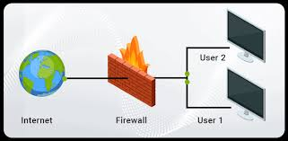

# PATOS/POMBO PSEL 2.0

### 1. Segurança & Redes - Firewall simples em UserSpace

Você deve fazer um firewall em userspace do **zero**, lidando com o recebimento e filtragem de pacotes, tudo isso na mão, sem usar qualquer biblioteca que abstraia demais o código. Você deve fazer com que o seu firewall atue em um IP diferente do IP da sua máquina, criando uma interface de rede virtual (TUN) e roteando o tráfego de uma sub-rede inteira (ex: 10.0.0.x/24) para ela.

Para que você tenha uma ideia geral do que é um firewall, separamos esta imagem:



Você não pode utilizar linguagens que abstraiam demais o seu código, ou seja: nada de Python e JavaScript. Exemplo (a não ser seguido):

```python
from pyfire import Firewall

firewall = Firewall(ip)

firewall.ban(word_list)
firewall.ban(ip)
```

 Nós particularmente recomendamos as seguintes linguagens:
- `C/C++`
- `ASM`
- `Go`
- `Rust`
- `Zig`
- `Clojure`
- `Erlang`
- Qualquer outra desde que **não** tenha muita coisa pronta.

Este desafio tem como objetivo testar a resiliência de vocês em aprender novas tecnologias e o quão longe estão dispostos a ir começando do zero.

> Você só deve utilizar bibliotecas que são ESSENCIAIS para o funcionamento do seu projeto e que não vão abstrair nenhum código relacionado ao funcionamento do firewall.

Os seguintes tópicos serão os principais **pontos de avaliação** do seu projeto:

- **Funcionamento em cima de um IP específico, diferente do IP da sua máquina**
- **Filtragem e resposta de PING (ICMP)**
    - Deve bloquear pelo menos um destino da sub-rede de receber qualquer pacote (ex: 10.0.0.2 e 10.0.0.3, recebem pacotes, já 10.0.0.50 não recebe pacote nenhum)
    - Deve responder ao ping efetuado por outro terminal

- **Filtragem de pacotes UDP**
    - Deve filtrar pacotes UDP recebidos baseado em uma lista de palavras proibidas

- **Filtragem de pacotes TCP**
    - Deve filtrar pacotes TCP recebidos baseado em uma lista de palavras proibidas

- Documentação
- Colaboração
    - Tente disponibilizar as fontes de pesquisa que você utilizou para construir seu projeto
- Organização e Versionamento de Código
- Experiência num geral. Não é só um código

Além disso, existem alguns diferenciais para este projeto que você pode tentar fazer (sendo completamente opcionais):
- Logs customizadas para cada interação no terminal
- Exibição do conteúdo dos pacotes (payload) caso existam
- Three-Way Handshake do TCP (SYN e SYN-ACK)
- Forjar pacotes ACK para aceitação e RST para rejeição de pacotes maliciosos.

Se você desejar inserir um diferencial diferente dos citados acima, sinta-se livre para fazer isso! Nós recomendamos fortemente que você não se limite a fazer apenas o que nós pedimos.

Você pode usar IA, mas caso você utilize, use com sabedoria, lembre-se que faremos perguntas técnicas sobre seu código durante a entrevista.

Outro ponto importante: nós queremos acompanhar o seu processo de aprendizado enquanto você faz o PSEL, então tente fazer commits sempre que você conseguir fazer algum progresso, grande ou pequeno!

``O código deve ser entregue em um repositório do GitHub, no caso, um fork deste repositório aqui. Quando tudo estiver finalizado, abra um pull request para a branch main e seu projeto estará entregue. Lembre-se de adicionar um README.md``

Se você tiver feito tudo corretamente e seu código for aprovado, você terá uma fase de entrevista, comum a todos os 4 desafios deste processo seletivo.

Finalmente, tenha em mente que:
- Você pode e deve contatar qualquer membro do PATOS em caso de dúvidas sobre o PSEL.
- Você pode deixar sua dúvida pública para outras pessoas que desejam fazer o PSEL mandando-a em [Issues](https://github.com/patos-ufscar/psel/issues)
- Não se sinta pressionado a fazer tudo, foque no que se sente confortável.
- Envie mesmo se não conseguir todas as partes essenciais, documente suas dificuldades.
- No seu README, descreva como foi fazer o processo seletivo, o que você aprendeu, etc. **Documente sua jornada**.

``Boa sorte!``

> Lembrando que o processo é pra ser bem de boa, queremos ver até onde conseguem ir/se empurram, sem preocupação em fazer todos os essenciais.

> É difícil de propósito pra separar quem está disposto a se desafiar de quem não quer sair da zona de conforto, então só de **tentar** fazer os essenciais, você já sai no lucro.


- Firewall escrito em C com poucas funcionalidades para referência: https://github.com/pagekite/libunaccept

- Como funciona um firewall: https://www.fortinet.com/resources/cyberglossary/how-does-a-firewall-work

